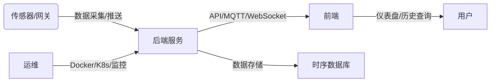

# 多源多点传感器数据集成系统参考架构

## 1. 传感器采集层（边缘侧/网关）
- 硬件：MCU（如STM32）、树莓派、工业PC
- 通信协议：串口（RS232/RS485）、TCP/IP、Modbus、CAN、MQTT
- 软件：嵌入式C/C++（驱动）或Python（上位机/网关）
- 数据格式：JSON、二进制、CSV

## 2. 数据接收与转发层（后端服务）
- 服务框架：Python（FastAPI/Django）、Node.js（Express/Koa）、Go
- 实时转发：MQTT Broker（如EMQX）、WebSocket服务
- 接口协议：RESTful API、GraphQL
- 数据校验与缓存：Redis、内存队列

## 3. 数据存储层
- 时序数据库：InfluxDB、TimescaleDB
- 历史数据库：PostgreSQL、MySQL
- 文件存储：Minio、OSS（可存原始数据包）

## 4. 前端可视化层
- 框架：React.js 或 Vue.js
- 实时图表库：ECharts、Chart.js、Highcharts
- 通信：WebSocket（用于推送实时数据）
- 页面模块：仪表盘（实时折线图）、历史查询、传感器管理

## 5. 运维与安全
- 部署：Docker、Kubernetes
- 监控：Prometheus、Grafana
- 日志：ELK（Elasticsearch-Logstash-Kibana）
- 安全：JWT鉴权、HTTPS、权限管理  

## 6. 典型数据流
1. 传感器每分钟采集一次数据，通过串口/网关推送至后端服务。
2. 后端服务校验、转发至MQTT/WebSocket，实时推送给前端。
3. 后端服务存储数据至时序数据库，便于历史查询和统计分析。
4. 前端页面可实时查看折线图，并可检索每天历史数据。
5. 运维层保障系统稳定、安全、可扩展。

---

## 参考技术组件清单
- MCU/树莓派（硬件采集）
- Python（采集/后端）、FastAPI、Node.js、Express
- MQTT Broker（EMQX）、WebSocket
- InfluxDB、TimescaleDB、PostgreSQL
- React.js/Vue.js、ECharts/Highcharts
- Docker、Kubernetes、Prometheus、Grafana
- ELK、JWT、安全模块

---

## 架构示意图（文档版）

---

## 适合参考的开源项目
- [Multi_Sensor_Fusion](https://blog.csdn.net/gitblog_00040/article/details/137670340)
- [GREAT-MSF](https://github.com/xinyeDai/GREAT-MSF)
- [compassPlus](https://gitee.com/hw_cc/compassPlus)
- [SensorFusionAlgorithm](https://github.com/chaksw/SensorFusionAlgorithm)

---

如需某一部分详细设计或代码示例，可进一步说明！